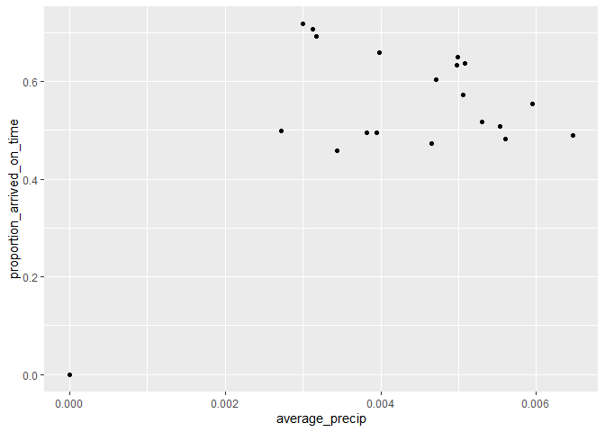
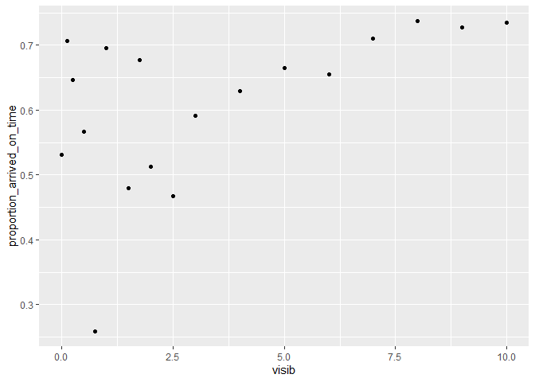

HW2
================
Andrew Li
2022-10-08

<https://github.com/P3BBL35/STAT433-HW2>

### What time of day should you fly if you want to avoid delays as much as possible?

``` r
flights %>%
  mutate(on_time = if_else(condition = arr_delay <= 0,
                           true = T,
                           false = F,
                           missing = F)) %>%
  group_by(hour) %>%
  summarise(proportion_arrived_on_time = mean(on_time),
            number_flights = n()) %>%
  arrange(desc(proportion_arrived_on_time))
```

    ## # A tibble: 20 × 3
    ##     hour proportion_arrived_on_time number_flights
    ##    <dbl>                      <dbl>          <int>
    ##  1     7                      0.717          22821
    ##  2     5                      0.705           1953
    ##  3     6                      0.692          25951
    ##  4     8                      0.658          27242
    ##  5     9                      0.649          20312
    ##  6    11                      0.638          16033
    ##  7    10                      0.633          16708
    ##  8    12                      0.604          18181
    ##  9    13                      0.572          19956
    ## 10    14                      0.554          21706
    ## 11    16                      0.517          23002
    ## 12    15                      0.508          23888
    ## 13    18                      0.498          21783
    ## 14    17                      0.495          24426
    ## 15    22                      0.493           2639
    ## 16    19                      0.489          21441
    ## 17    20                      0.482          16739
    ## 18    23                      0.471           1061
    ## 19    21                      0.457          10933
    ## 20     1                      0                  1

To avoid delays as much as possible, you want to fly at 7am, as it has
the highest proportion of flights that arrive on time.

### Does this choice depend on anything? Season? Weather? Airport? Airline? Find three patterns (“null results” are ok!)

The choice does seem to depend on weather and the airline. It does not
seem to depend on the airport from which a flight took off.

#### Airline

``` r
flights2 <- flights %>%
  select(year:day, hour, tailnum, carrier, arr_delay)
flights2 %>%
  left_join(airlines, by = 'carrier') %>%
  filter(hour == 7) %>%
  mutate(on_time = if_else(condition = arr_delay <= 0,
                           true = T,
                           false = F,
                           missing = F)) %>%
  group_by(name) %>%
  summarise(proportion_arrived_on_time = mean(on_time),
            number_flights = n()) %>%
  arrange(desc(proportion_arrived_on_time))
```

    ## # A tibble: 13 × 3
    ##    name                        proportion_arrived_on_time number_flights
    ##    <chr>                                            <dbl>          <int>
    ##  1 Frontier Airlines Inc.                           1                  1
    ##  2 Alaska Airlines Inc.                             0.819            349
    ##  3 Virgin America                                   0.774            973
    ##  4 Endeavor Air Inc.                                0.761            628
    ##  5 American Airlines Inc.                           0.758           3348
    ##  6 Delta Air Lines Inc.                             0.758           3787
    ##  7 Southwest Airlines Co.                           0.725           1351
    ##  8 United Air Lines Inc.                            0.716           4460
    ##  9 US Airways Inc.                                  0.716            912
    ## 10 JetBlue Airways                                  0.679           3588
    ## 11 ExpressJet Airlines Inc.                         0.651           2370
    ## 12 Envoy Air                                        0.602            992
    ## 13 AirTran Airways Corporation                      0.532             62

With the above chart, you can see that the proportions vary quite widely
across the different airlines at 7am. For example, AirTran Airways has
the lowest proportion of its flight making it on time at 0.532, where
Alaska Airlines has a relatively larger proportion, sitting at 0,819.
However, we still need to take into account the number of flights being
recorded, as a lower sample size means a less accurate record of their
true average ability of being on time. For example, Frontier Airlines
has a perfect record, but only has 1 recorded flight at 7am.

#### Weather

``` r
flights2 <- flights %>%
  select(year:day, hour, arr_delay)
flights2 %>%
  left_join(weather, by = c('year', 'month', 'day', 'hour')) %>%
  mutate(on_time = if_else(condition = arr_delay <= 0,
                           true = T,
                           false = F,
                           missing = F)) %>%
  group_by(hour) %>%
  summarise(proportion_arrived_on_time = mean(on_time),
            number_flights = n(),
            average_precip = mean(precip, na.rm = T)) %>%
  ggplot(aes(x = average_precip, y = proportion_arrived_on_time)) + geom_point()
```

<!-- -->

There does not seem to be a very clear relationship between amount of
precipitation and the proportion of flights that arrived on-time,
especially after removing the outlier at (0,0)

``` r
flights2 <- flights %>%
  select(year:day, hour, arr_delay)
flights2 %>%
  left_join(weather, by = c('month', 'day', 'hour')) %>%
  filter(hour == 7) %>%
  mutate(on_time = if_else(condition = arr_delay <= 0,
                           true = T,
                           false = F,
                           missing = F)) %>%
  group_by(visib) %>%
  summarise(proportion_arrived_on_time = mean(on_time),
            number_flights = n()) %>%
  ggplot(aes(x = visib, y = proportion_arrived_on_time)) +
    geom_point()
```

    ## Warning: Removed 1 rows containing missing values (geom_point).

<!-- -->

However, there is a clear relationship between the visibility due to
weather conditions and the proportion of flights that arrived on-time.
And this makes sense. Lower visibility makes it harder for planes to
navigate in the air, causing them to go through turbulence or go slower
due to requiring navigational signals to make sure they’re going the
right way/not going to crash into anything else. Thus, a good way to
increase your chances of being on-time is to ensure weather will be
clear at the time of takeoff.

#### Airport

``` r
flights2 <- flights %>%
  select(year:day, hour, origin, arr_delay)
flights2 %>%
  left_join(airports, by = c('origin' = 'faa')) %>%
  filter(hour == 7) %>%
  mutate(on_time = if_else(condition = arr_delay <= 0,
                           true = T,
                           false = F,
                           missing = F)) %>%
  group_by(name) %>%
  summarise(proportion_arrived_on_time = mean(on_time),
            number_flights = n())
```

    ## # A tibble: 3 × 3
    ##   name                proportion_arrived_on_time number_flights
    ##   <chr>                                    <dbl>          <int>
    ## 1 John F Kennedy Intl                      0.719           7026
    ## 2 La Guardia                               0.729           7137
    ## 3 Newark Liberty Intl                      0.706           8658

There is no clear relationship between the airport from which you
started flying and the proportion of flights that arrive on time. Across
all the airports, the proportion of flights that arrived on time when
departing from the airport sits around 0.55-0.60. This means that if
you’re planning on taking a flight from New York to anywhere else, the
airport you choose does not really matter with regards to being on time.
